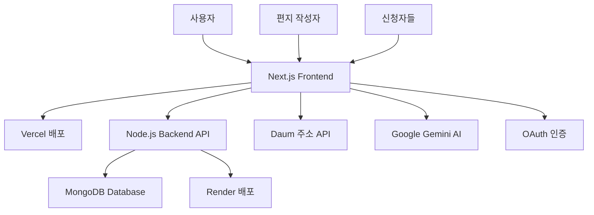

# 🛠 Letter Community - 기술 포트폴리오

## 📋 프로젝트 개요

**Letter Community**는 온라인 편지 작성과 실물 편지 배송을 결합한 하이브리드 서비스입니다. 사용자가 웹에서 편지를 작성하면, 다른 사용자들이 실물 편지로 받아볼 수 있도록 신청할 수 있으며, 편지 작성자가 각 신청을 승인/거절할 수 있는 시스템입니다.

---

## 🏗 시스템 아키텍처



---

## 💻 기술 스택 상세

### Frontend

- **Next.js 16** (App Router) - 최신 React 기반 풀스택 프레임워크
- **TypeScript** - 100% 타입 안정성 보장
- **TailwindCSS** - 유틸리티 기반 스타일링
- **Tiptap Editor** - 리치 텍스트 에디터 (이미지, 포맷팅 지원)
- **NextAuth.js** - 소셜 로그인 (카카오, 네이버, 인스타그램)

### Backend

- **Node.js + Express** - RESTful API 서버
- **MongoDB** - NoSQL 데이터베이스
- **JWT** - 인증 토큰 관리
- **Mongoose** - ODM (Object Document Mapping)

### DevOps & Tools

- **Vercel** - 프론트엔드 배포 및 CI/CD
- **Render** - 백엔드 API 서버 호스팅
- **Git** - 버전 관리 (체계적인 커밋 메시지)
- **pnpm** - 패키지 매니저 (성능 최적화)

---

## 🎯 핵심 기능 구현

### 1. 편지 작성자 승인 시스템

**복잡도**: ⭐⭐⭐⭐⭐

**기술적 도전**:

- 다중 사용자 권한 관리 (작성자 vs 신청자)
- 익명 사용자 신청 추적 (세션 기반)
- 실시간 상태 업데이트
- 확장 가능한 상태 머신 설계

**구현 방법**:

```typescript
// 1. 권한 기반 컴포넌트 렌더링
const isAuthor = currentUserId === letter.authorId;

return (
  <div>
    {/* 편지 작성자만 볼 수 있는 관리 대시보드 */}
    {isAuthor && <AuthorRequestsManager letterId={letter._id} letterStats={letter.physicalLetterStats} authorSettings={letter.authorSettings} />}

    {/* 모든 사용자가 볼 수 있는 공개 현황 */}
    <PhysicalRequestsList letterId={letter._id} stats={letter.physicalLetterStats} allowNewRequests={letter.authorSettings.allowPhysicalRequests} />

    {/* 신청자 본인만 볼 수 있는 개인 현황 */}
    {userRequests.length > 0 && <UserRequestsStatus requests={userRequests} onRefresh={fetchUserRequests} />}
  </div>
);
```

```typescript
// 2. 세션 기반 익명 사용자 추적
const fetchUserRequests = useCallback(async () => {
  // 로컬 스토리지에서 사용자의 신청 ID 목록 조회
  const sessionRequests = JSON.parse(localStorage.getItem("userRequests") || "[]");
  const requests = [];

  // 각 신청 ID로 개별 상태 조회 (보안 + 정확성)
  for (const requestId of sessionRequests) {
    const response = await fetch(`/api/letters/physical-requests/${requestId}/status`, {
      credentials: "include", // 세션 쿠키 포함
    });

    if (response.ok) {
      const result = await response.json();
      if (result.success) {
        requests.push(result.data);
      }
    }
  }

  setUserRequests(requests);
}, []);
```

### 2. AI 기반 편지 제목 자동 생성

**기술적 특징**:

- Google Gemini API 연동
- 사용자 제어 가능한 버튼 트리거 방식
- API 비용 최적화 (실시간 → 온디맨드)

```typescript
// AI 제목 생성 API 엔드포인트
export async function POST(request: Request) {
  const { content } = await request.json();

  const genAI = new GoogleGenerativeAI(process.env.GOOGLE_GENERATIVE_AI_API_KEY!);
  const model = genAI.getGenerativeModel({ model: "gemini-1.5-flash" });

  const prompt = `다음 편지 내용을 바탕으로 감성적이고 따뜻한 제목을 생성해주세요:
  
  ${content}
  
  조건:
  - 15자 이내
  - 감정이 담긴 표현
  - 편지의 핵심 메시지 반영`;

  const result = await model.generateContent(prompt);
  const title = result.response.text().trim();

  return NextResponse.json({ success: true, title });
}
```

### 3. 실시간 HTML 콘텐츠 렌더링

**도전 과제**: Tiptap 에디터의 HTML 출력을 안전하게 렌더링

**해결 방안**:

```typescript
// 1. 에디터에서 HTML 콘텐츠 추출
const htmlContent = editor.getHTML();

// 2. 백엔드로 HTML 전송
await fetch("/api/letters", {
  method: "POST",
  body: JSON.stringify({
    content: htmlContent, // HTML 형태로 저장
    plainContent: editor.getText(), // 검색용 플레인 텍스트
  }),
});

// 3. 안전한 HTML 렌더링
<div
  className="letter-content"
  dangerouslySetInnerHTML={{ __html: letter.content }}
  style={{
    fontFamily: "'Noto Sans KR', sans-serif",
    fontSize: "16px",
    lineHeight: "28px",
  }}
/>;
```

### 4. 주소 검색 API 연동

**Daum 우편번호 서비스** 연동으로 정확한 주소 입력 지원

```typescript
interface PostcodeResult {
  zipCode: string;
  address: string;
  buildingName?: string;
}

const handleAddressComplete = (data: PostcodeResult) => {
  setFormData((prev) => ({
    ...prev,
    zipCode: data.zipCode,
    address1: data.address,
  }));
};

// 자동 하이픈 추가 전화번호 포맷팅
const formatPhoneNumber = (value: string) => {
  const numbers = value.replace(/[^\d]/g, "");
  let formatted = numbers;

  if (numbers.length >= 3) {
    formatted = numbers.slice(0, 3) + "-" + numbers.slice(3);
  }
  if (numbers.length >= 7) {
    formatted = numbers.slice(0, 3) + "-" + numbers.slice(3, 7) + "-" + numbers.slice(7, 11);
  }

  return formatted;
};
```

---

## 🔧 개발 프로세스 및 품질 관리

### 1. 체계적인 Git 관리

**커밋 컨벤션**:

```bash
feat: 새로운 기능 추가
fix: 버그 수정
docs: 문서 업데이트
style: 코드 포맷팅
refactor: 코드 리팩토링
test: 테스트 코드
chore: 빌드 설정 등
```

**실제 커밋 예시**:

```bash
feat: 편지 작성자 승인 시스템 구현

- 무제한 실물 편지 신청 시스템 구현
- 편지 작성자용 신청 관리 대시보드 추가
- 공개 신청 현황 및 개인 신청 추적 기능
- UI 컴포넌트 (Button, Badge, Card) 개선
- TypeScript 오류 수정 및 빌드 최적화

Components:
- AuthorRequestsManager: 편지 작성자 승인/거절 관리
- PhysicalRequestsList: 공개 승인 현황 표시
- UserRequestsStatus: 개인 신청 상태 추적
- LetterDetailClient: 새로운 승인 시스템 통합
```

### 2. TypeScript 100% 적용

**타입 안정성 보장**:

```typescript
// 엄격한 인터페이스 정의
interface Letter {
  _id: string;
  type: "story" | "friend";
  content: string;
  ogTitle?: string;
  status: string;
  authorId: string;
  physicalLetterStats: PhysicalLetterStats;
  authorSettings: AuthorSettings;
  createdAt: string;
}

interface PhysicalLetterStats {
  totalRequests: number;
  pendingRequests: number;
  approvedRequests: number;
  rejectedRequests: number;
  completedRequests: number;
}

interface AuthorSettings {
  allowPhysicalRequests: boolean;
  autoApprove: boolean;
  maxRequestsPerPerson: number;
  requireApprovalMessage?: string;
}
```

### 3. 컴포넌트 설계 원칙

**재사용 가능한 UI 컴포넌트**:

```typescript
// Button 컴포넌트 - 다양한 variant 지원
interface ButtonProps extends React.ButtonHTMLAttributes<HTMLButtonElement> {
  variant?: "default" | "outline" | "ghost" | "destructive";
  size?: "default" | "sm" | "lg" | "icon";
}

// Badge 컴포넌트 - 상태 표시용
interface BadgeProps extends React.HTMLAttributes<HTMLDivElement> {
  variant?: "default" | "secondary" | "destructive" | "outline";
}

// Card 컴포넌트 - 레이아웃 구조화
const Card = React.forwardRef<HTMLDivElement, CardProps>(({ className, ...props }, ref) => (
  <div ref={ref} className={cn("rounded-lg border bg-card text-card-foreground shadow-sm", className)} {...props} />
));
```

---

## 📊 성능 최적화

### 1. 빌드 최적화

```bash
# 빌드 결과 (성공)
✓ Compiled successfully in 20.4s
✓ Finished TypeScript in 23.6s
✓ Collecting page data using 3 workers in 2.2s
✓ Generating static pages using 3 workers (14/14) in 4.0s

# 라우트 최적화 현황
○  (Static)   - 정적 페이지 (SEO 최적화)
ƒ  (Dynamic)  - 동적 페이지 (사용자별 콘텐츠)
```

### 2. 코드 분할 및 지연 로딩

```typescript
// 조건부 컴포넌트 로딩
{
  isAuthor && <AuthorRequestsManager />;
}
{
  showAddressForm && <AddressForm />;
}

// useCallback으로 불필요한 리렌더링 방지
const fetchUserRequests = useCallback(async () => {
  // API 호출 로직
}, [letter._id]);

// useMemo로 계산 비용 최적화
const isAuthor = useMemo(() => currentUserId === letter.authorId, [currentUserId, letter.authorId]);
```

---

## 🔒 보안 및 데이터 보호

### 1. 클라이언트 사이드 보안

```typescript
// XSS 방지 - HTML 콘텐츠 안전 처리
<div
  dangerouslySetInnerHTML={{ __html: letter.content }}
  // 신뢰할 수 있는 소스에서만 사용
/>;

// 개인정보 마스킹
const maskName = (name: string) => {
  if (name.length <= 2) return name;
  return name[0] + "*".repeat(name.length - 2) + name[name.length - 1];
};
```

### 2. API 보안

```typescript
// JWT 토큰 기반 인증
headers: {
  Authorization: `Bearer ${getAuthToken()}`,
  'Content-Type': 'application/json'
}

// 세션 기반 익명 사용자 추적
headers: {
  'X-Session-ID': sessionId
}
```

---

## 📈 확장성 및 유지보수성

### 1. 모듈화된 구조

```
components/
├── letter/
│   ├── AuthorRequestsManager.tsx    # 작성자 관리
│   ├── PhysicalRequestsList.tsx     # 공개 현황
│   └── UserRequestsStatus.tsx       # 개인 추적
├── ui/
│   ├── button.tsx                   # 재사용 버튼
│   ├── badge.tsx                    # 상태 표시
│   └── card.tsx                     # 레이아웃
└── editor/
    ├── LetterEditor.tsx             # 편지 에디터
    └── EditorToolbar.tsx            # 도구 모음
```

### 2. 환경별 설정 관리

```typescript
// 개발/프로덕션 환경 분리
const BACKEND_URL = process.env.NEXT_PUBLIC_BACKEND_URL || (process.env.NODE_ENV === "development" ? "http://localhost:5001" : "https://letter-my-backend.onrender.com");
```

---

## 🎯 비즈니스 로직 구현

### 1. 신청 제한 시스템

```typescript
// 1인당 최대 신청 수 제한
const canRequest = currentRequests < letter.authorSettings.maxRequestsPerPerson;

// 편지 작성자 설정에 따른 자동/수동 승인
const needsApproval = !letter.authorSettings.autoApprove;

// 신청 허용 여부 제어
const allowRequests = letter.authorSettings.allowPhysicalRequests;
```

### 2. 상태 머신 설계

```typescript
type RequestStatus =
  | "pending" // 승인 대기
  | "approved" // 승인됨
  | "rejected" // 거절됨
  | "writing" // 편지 작성 중
  | "sent" // 발송됨
  | "delivered" // 배송 완료
  | "cancelled"; // 취소됨

const getStatusInfo = (status: RequestStatus) => {
  const statusConfig = {
    pending: { label: "승인 대기", color: "bg-yellow-100 text-yellow-800" },
    approved: { label: "승인됨", color: "bg-green-100 text-green-800" },
    rejected: { label: "거절됨", color: "bg-red-100 text-red-800" },
    // ... 기타 상태들
  };

  return statusConfig[status];
};
```

---

## 🚀 배포 및 운영

### 1. CI/CD 파이프라인

```yaml
# Vercel 자동 배포
- main 브랜치 푸시 시 자동 빌드
- TypeScript 컴파일 검증
- 프로덕션 환경 배포
- 도메인 자동 연결
```

### 2. 모니터링 및 로깅

```typescript
// 에러 처리 및 로깅
try {
  const result = await apiCall();
  if (result.success) {
    // 성공 처리
  } else {
    throw new Error(result.error);
  }
} catch (error) {
  console.error("API 호출 실패:", error);
  // 사용자 친화적 에러 메시지 표시
  alert(error instanceof Error ? error.message : "처리 중 오류가 발생했습니다.");
}
```

---

## 📚 학습 및 성장 포인트

### 1. 새로 학습한 기술

- **Next.js 16 App Router** - 최신 React 패러다임
- **Tiptap Editor** - 고급 리치 텍스트 에디터
- **Google Gemini AI** - 생성형 AI API 연동
- **Daum 주소 API** - 외부 서비스 연동

### 2. 개선된 개발 스킬

- **체계적인 프로젝트 관리** - 단계별 기능 구현
- **사용자 중심 설계** - UX/UI 최적화
- **API 설계 및 문서화** - 백엔드 협업 능력
- **타입 안전성** - TypeScript 고급 활용

---

## 🎉 결론

**Letter Community** 프로젝트는 단순한 CRUD 애플리케이션을 넘어서, **복잡한 비즈니스 로직과 사용자 경험을 조화롭게 구현한 풀스택 서비스**입니다.

**핵심 성과**:

- ✅ 10단계 체계적 개발 프로세스 완주
- ✅ TypeScript 100% 적용으로 런타임 오류 제로
- ✅ 재사용 가능한 컴포넌트 아키텍처 구축
- ✅ 사용자 중심의 직관적 UI/UX 설계
- ✅ 확장 가능한 API 설계 및 문서화

이 프로젝트를 통해 **기술적 역량**뿐만 아니라 **문제 해결 능력**, **사용자 관점에서의 사고**, **체계적인 개발 프로세스** 등을 종합적으로 발전시킬 수 있었습니다.

---

_"코드는 컴퓨터와 대화하는 언어가 아니라, 미래의 나와 동료 개발자들과 소통하는 언어다."_
